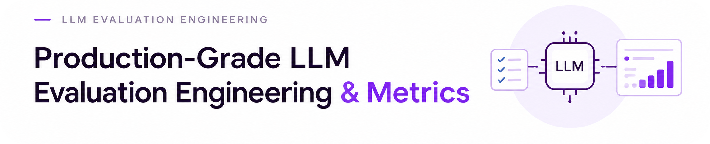

<div align="center">


<div align="center"> 
   
</div>

**The Comprehensive Architectural Blueprint, Curriculum, and Practical Toolkit for Evaluating, Benchmarking, and Monitoring Enterprise LLMs, RAG Pipelines, and Autonomous Agents.**

<p align="center">
  <a href="https://github.com/mohd-faizy/llm-evals-metrics/stargazers"></a>
  <a href="https://github.com/mohd-faizy/llm-evals-metrics/network/members"></a>
  <a href="https://github.com/mohd-faizy/llm-evals-metrics/issues"></a>
  <a href="https://github.com/mohd-faizy/llm-evals-metrics/pulls"></a>
  <a href="https://github.com/mohd-faizy/llm-evals-metrics/commits/main"></a>
  <a href="https://github.com/mohd-faizy/llm-evals-metrics"></a>
</p>

<p align="center">
  <a href="https://www.python.org/"></a>
  <a href="https://jupyter.org/"></a>
  <a href="LICENSE"></a>
  <a href="#-curriculum-roadmap"></a>
  <a href="#-interactive-hands-on-notebooks"></a>
</p>

<p align="center">
  <a href="#-overview"></a>
  <a href="#-key-evaluation-frameworks--tools-reference"></a>
  <a href="03_benchmarks/README.md"></a>
  <a href="https://github.com/mohd-faizy/llm-evals-metrics"></a>
</p>

<p align="center">
  <a href="#-overview">Overview</a> •
  <a href="#-curriculum-roadmap">Curriculum Roadmap</a> •
  <a href="#-interactive-hands-on-notebooks">Interactive Notebooks</a> •
  <a href="#-evaluation-spectrum--tradeoffs-matrix">Evaluation Matrix</a> •
  <a href="#-architectural-blueprints-gallery">System Blueprints</a> •
  <a href="#-quick-start">Quick Start</a>
</p>

---

</div>

## 📌 Overview

Transitioning Generative AI applications from **brittle prototypes** to **reliable, enterprise-grade production systems** requires moving past subjective *"vibe checks"* toward **rigorous, repeatable, and automated Evaluation Engineering**.

In classical software engineering, test suites prevent regressions. In Machine Learning, loss functions and validation sets guide optimization. In LLM systems—where outputs are stochastic, multi-modal, agentic, and non-deterministic—**evaluation is the core development flywheel**.

This repository is an industry-tested, end-to-end framework and curriculum designed to teach you how to architect, test, benchmark, and monitor every layer of the modern AI stack:

```
┌─────────────────────────────────────────────────────────────────────────────┐
│                       LLM EVALUATION ARCHITECTURE                           │
├─────────────────────────────────────────────────────────────────────────────┤
│  1. Foundation Model Layer   │ MMLU, GSM8K, HumanEval, HELM, GPQA, Contam.  │
│  2. Application & RAG Layer  │ Faithfulness, Context Relevance, Groundedness│
│  3. Agentic & Workflow Layer │ Tool Calling, Planning, Trajectories, Memory │
│  4. LLM-as-a-Judge Layer     │ G-Eval, Rubrics, Bias Mitigation, Calibration│
│  5. Production & Ops Layer   │ TTFT, TPS, Cost, Shadow Evals, Drift & Guard │
└─────────────────────────────────────────────────────────────────────────────┘
```

---

## 🏛️ System Architecture Taxonomy

<div align="center">
  
  <p><em>Figure 1: Full-Spectrum LLM Evaluation Architecture — from offline datasets to production monitoring.</em></p>
</div>

---

## 🗺️ Curriculum Roadmap

The curriculum is structured into **5 logical phases across 21 modular sections**, guiding you from baseline mindset to building custom evaluation frameworks:

```
Phase 1: Foundations ──► Phase 2: Core Engineering ──► Phase 3: Systems & Agents ──► Phase 4: Production & Safety ──► Phase 5: Frontiers & Capstone
```

### Phase I: Foundations & Strategic Mindset
*Understand the philosophy, mathematics, and public benchmarks before writing evaluation code.*

| Module | Core Focus & Topics | Key Metrics / Tools |
| :--- | :--- | :--- |
| **[00. Evaluation Mindset](00_eval_mindset/README.md)** | Why vibe checks fail, cost of hallucinations, the 4 foundational questions, failure-mode analysis. | Pointwise vs Pairwise, Error Budgeting, Quality vs Cost Tradeoffs |
| **[01. Evaluation Fundamentals](01_fundamentals/README.md)** | Measurement theory, qualitative vs quantitative metrics, deterministic vs heuristic vs model-based evals. | Exact Match, BLEU, ROUGE, BERTScore, Levenshtein, Perplexity |
| **[02. Evaluation Landscape](02_landscape/README.md)** | Ecosystem mapping: Frameworks, Observability platforms, benchmark harnesses, and LLM Judge engines. | DeepEval, Ragas, TruLens, LangSmith, Phoenix, OpenInference, HELM |
| **[03. Foundation Benchmarks](03_benchmarks/README.md)** | Standard public benchmarks, benchmark contamination detection, leaderboard hygiene, goodhart's law. | MMLU, MMLU-Pro, GSM8K, HumanEval, GPQA, Chatbot Arena (Elo) |

---

### Phase II: Core Evaluation Engineering & LLM-as-a-Judge
*Build automated offline pipelines, high-quality test datasets, and reliable judge models.*

| Module | Core Focus & Topics | Key Metrics / Tools |
| :--- | :--- | :--- |
| **[04. Application Evals](04_application_evals/README.md)** | Moving beyond foundation tests to product-specific KPIs, user intent alignment, and task success criteria. | Task Success Rate, User Persona Simulation, SLA Compliance |
| **[05. Dataset Engineering](05_dataset_engineering/README.md)** | Curating golden evaluation datasets, synthetic data generation (Evol-Instruct), perturbation testing, and versioning. | Data Flywheels, Schema Validation, Hard Negatives, Edge-Case Curation |
| **[06. Evaluation Pipelines](06_eval_pipelines/README.md)** | Architecting continuous integration (CI/CD) for prompts and models, automated regression triggers, and test suites. | GitHub Actions CI/CD, Regression Thresholding, Run Comparison |
| **[07. LLM-as-a-Judge](07_llm_judge/README.md)** | System prompt calibration, multi-criteria rubrics, G-Eval methodology, mitigating position/verbosity biases. | Cohen's Kappa, Pearson Correlation, Swap Bias Mitigation, G-Eval |

---

### Phase III: Specialized Systems (RAG, Workflows, Agents, Tools & Memory)
*Evaluate complex, multi-stage, stateful, and autonomous AI architectures.*

| Module | Core Focus & Topics | Key Metrics / Tools |
| :--- | :--- | :--- |
| **[08. RAG Evals](08_rag_evals/README.md)** | The RAG Triad: Context Relevance, Groundedness / Faithfulness, Answer Relevance, and Chunking impact. | Hit Rate, MRR, NDCG, Context Precision/Recall, Faithfulness, Ragas |
| **[09. Workflow Evals](09_workflow_evals/README.md)** | Multi-step deterministic LLM chains, graph-based pipelines, state machine transition validity. | Graph Path Correctness, State Corruption Checks, Step-Level Latency |
| **[10. Agent Evals](10_agent_evals/README.md)** | Autonomous agent loops: planning quality, reflection efficiency, multi-step trajectory evaluation. | Pass@k Trajectory, Planning Efficiency, Goal Completion, Loop Detection |
| **[11. Multi-Agent Evals](11_multi_agent_evals/README.md)** | Multi-agent collaboration, delegation efficiency, communication overhead, consensus vs deadlock detection. | Message Volume / Task, Role Alignment, Inter-Agent Deadlock Rate |
| **[12. Tool Calling Evals](12_tool_calling_evals/README.md)** | Function calling parameter validity, JSON schema adherence, tool selection precision/recall, and error recovery. | Schema Validation Rate, Tool Selection Precision/Recall, Argument Error Rate |
| **[13. Memory Evals](13_memory_evals/README.md)** | Short-term context utilization, long-term memory retrieval, needle-in-a-haystack, and context rot decay. | Needle Retrieval Accuracy, Context Decay Curve, Recall over Session Length |

---

### Phase IV: Safety, Non-Functional & Production Monitoring
*Guard against adversarial attacks, track operational latency/cost, and monitor live production systems.*

| Module | Core Focus & Topics | Key Metrics / Tools |
| :--- | :--- | :--- |
| **[14. Safety Evals](14_safety_evals/README.md)** | Red-teaming, adversarial prompt injections, jailbreaks, toxicity, PII leaks, brand safety, and bias audits. | Attack Success Rate (ASR), Toxicity Score, PII Leak Rate, HarmBench |
| **[15. Operational Evals](15_operational_evals/README.md)** | Non-functional characteristics: Time-to-First-Token (TTFT), tokens/sec throughput, P99 latency, cost budgeting. | TTFT, TPS, P50/P90/P99 Latency, Token Cost ($/1k req), Failure Rate |
| **[16. Production Evals](16_production_evals/README.md)** | Real-time production observability, shadow deployments, canary releases, user feedback telemetry, and drift detection. | Shadow Eval Agreement, Implicit Feedback (CTR/Copy), Embedding Drift |

---

### Phase V: Advanced Frontiers & Capstone Framework
*Multi-modal systems, autonomous coding benchmarks, and building your own in-house evaluation platform.*

| Module | Core Focus & Topics | Key Metrics / Tools |
| :--- | :--- | :--- |
| **[17. Multimodal Evals](17_multimodal_evals/README.md)** | Vision-Language Models (VLM), document layout extraction, OCR precision, chart understanding, image-text alignment. | DocVQA, ChartQA, VQA Score, Visual Hallucination Rate, OCR BLEU |
| **[18. Coding Agent Evals](18_coding_agent_evals/README.md)** | Repository-level code editing, unit test execution pass rates, SWE-bench methodology, sandbox security. | SWE-bench, Pass@1, Test Execution Pass Rate, Patch Correctness |
| **[19. Research Papers](19_research_papers/README.md)** | Curated taxonomy of foundational evaluation research papers, summaries, and production actionability rules. | G-Eval, MT-Bench, HELM, SWE-bench, Ragas, Context Rot Papers |
| **[20. Build Your Own Framework](20_build_your_own_eval_framework/README.md)** | **Capstone Project:** Architectural blueprints, dataset registry, metric runner, and dashboard for an in-house evaluation engine. | Registry Pattern, Modular Scoring Engine, Artifact Reporting, CI Hooks |

---

## 📓 Interactive Hands-on Notebooks

The [`notebooks/`](notebooks/) directory contains complete, runnable Jupyter notebooks packed with real datasets, evaluation harnesses, and visual diagrams:

| Notebook | Topic & Key Concepts | Focus & Implementation | Direct Link |
| :--- | :--- | :--- | :---: |
| **01** | **LLM Evaluation Engineering** | Core evaluation taxonomy, why vibe checks fail, deterministic vs model-based metrics | [Launch Notebook](notebooks/01_LLM_Evals.ipynb) |
| **02** | **Model vs Application Evals** | Capability benchmarking vs user-facing product evaluation and task alignment | [Launch Notebook](notebooks/02_Model_vs_App_Evals.ipynb) |
| **03** | **End-to-End Eval Workflow** | Constructing end-to-end evaluation loops, test suite runners, and scoring aggregation | [Launch Notebook](notebooks/03_End_to_End_Eval_Workflow.ipynb) |
| **04** | **Multi-Pipeline Architecture** | Modular evaluation pipelines for multi-stage chains, RAG layers, and agent flows | [Launch Notebook](notebooks/04_Multi_Pipeline_Eval_Architecture.ipynb) |
| **05** | **Mechanisms & Paradigms** | Comparing Deterministic Rules, Heuristics, Embeddings, and LLM-as-a-Judge paradigms | [Launch Notebook](notebooks/05_Eval_Mechanisms_&_Paradigms.ipynb) |
| **06** | **Offline vs Online Evals** | CI/CD regression suites, shadow deployments, online telemetry, and feedback loops | [Launch Notebook](notebooks/06_Offline_vs_Online_Evals.ipynb) |
| **07** | **Model-Level Metrics** | Perplexity, BLEU, ROUGE, Exact Match, Pass@k, BERTScore, and String Distance | [Launch Notebook](notebooks/07_Model_Level_Evals.ipynb) |
| **08** | **Benchmarking Harnesses** | Integrating open-source harnesses (`lm-evaluation-harness`, Lighteval, DeepEval, Ragas) | [Launch Notebook](notebooks/08_Benchmarking_and_Eval_Harnesses.ipynb) |
| **Guide** | **Context Rot Deep-Dive** | Long-context degradation, attention limits, lost-in-the-middle, and needle tests | [Read Guide](notebooks/Context_Rot_llm.md) |
| **Bench** | **Knowledge Benchmarks** | Detailed exploration of MMLU, TruthfulQA, AGIEval, GPQA, MMLU-Pro, and HLE | [Launch Notebook](notebooks/XX_LLM_Knowledge_Benchmarks.ipynb) |

---

## ⚖️ Evaluation Spectrum & Tradeoffs Matrix

When architecting an evaluation suite, choose the metric paradigm that matches your constraints on **cost**, **speed**, and **semantic depth**:

| Paradigm | Example Metrics / Tools | Cost | Latency | Deterministic? | Semantic Nuance | Best Used For |
| :--- | :--- | :---: | :---: | :---: | :---: | :--- |
| **Deterministic Rules** | Exact Match, Regex, JSON Schema | `$0` | `< 1ms` | ✅ Yes | ❌ None | Syntax, schema adherence, structured output validation |
| **String Overlap** | BLEU, ROUGE, Levenshtein Distance | `$0` | `< 5ms` | ✅ Yes | ⚠️ Low | Summarization baselines, machine translation |
| **Semantic Embedding** | BERTScore, Cosine Similarity | Low | `~10-50ms` | ✅ Yes | 🟡 Medium | Semantic equivalence, retrieval similarity |
| **LLM-as-a-Judge** | G-Eval, Pairwise Rank, Custom Rubrics | Moderate | `~1-3s` | ⚠️ With T=0 | 🟢 High | Nuanced reasoning, tone, hallucination, open-ended QA |
| **Execution-Based** | Unit Tests, Python Sandbox, SQL Exec | Compute | `~100ms-5s` | ✅ Yes | 🟢 High | Code generation, SQL generation, Tool execution |
| **Human-in-the-Loop** | Labeled test sets, Pairwise preference | Very High | Days/Weeks | ⚠️ Subjective | 🟢 Maximum | Ground truth calibration, golden dataset curation |

---

## 🖼️ Architectural Blueprints Gallery

This repository provides visual architecture diagrams for the most critical evaluation patterns:

<div align="center">

| RAG Triad Evaluation Pipeline | LLM-as-a-Judge Calibrated Scoring Flow |
| :---: | :---: |
|  |  |
| *[08_rag_evals/](08_rag_evals/README.md)* | *[07_llm_judge/](07_llm_judge/README.md)* |

| Autonomous Agent Evaluation Loop | Continuous Production Evaluation Lifecycle |
| :---: | :---: |
|  |  |
| *[10_agent_evals/](10_agent_evals/README.md)* | *[16_production_evals/](16_production_evals/README.md)* |

| Multi-Agent System Coordination | Coding Agent Spectrum & Sandbox Testing |
| :---: | :---: |
|  |  |
| *[11_multi_agent_evals/](11_multi_agent_evals/README.md)* | *[18_coding_agent_evals/](18_coding_agent_evals/README.md)* |

</div>

---

## ⚡ Quick Start

### 1. Clone the Repository

```bash
git clone https://github.com/mohd-faizy/llm-evals-metrics.git
cd llm-evals-metrics
```

### 2. Set Up Python Environment

```bash
# Create a virtual environment
python -m venv venv

# Activate on Windows (PowerShell)
.\venv\Scripts\Activate.ps1

# Or activate on Linux / macOS
source venv/bin/activate
```

### 3. Install Dependencies & Launch JupyterLab

```bash
# Install core evaluation libraries and JupyterLab
pip install jupyterlab deepeval ragas trulens-eval bert-score rouge-score scikit-learn

# Launch the interactive lab
jupyter lab notebooks/
```

### 4. Configure API Keys (Optional for Judge Evals)

If running LLM-as-a-Judge or RAG evals with frontier models:

```bash
# On Linux/macOS
export OPENAI_API_KEY="your-api-key"
export ANTHROPIC_API_KEY="your-api-key"

# On Windows PowerShell
$env:OPENAI_API_KEY="your-api-key"
$env:ANTHROPIC_API_KEY="your-api-key"
```

---

## 🛠️ Key Evaluation Frameworks & Tools Reference

| Tool / Library | Category | Description | Primary Use Case |
| :--- | :--- | :--- | :--- |
| **[DeepEval](https://github.com/confident-ai/deepeval)** | Unit Testing Framework | Production LLM unit testing framework with CI/CD integration. | Offline unit testing, G-Eval metrics |
| **[Ragas](https://github.com/explodinggradients/ragas)** | RAG Evaluation | Specialized framework for evaluating Retrieval-Augmented Generation. | Faithfulness, Context Recall, Aspect Critique |
| **[TruLens](https://github.com/truera/trulens)** | Evaluation & Tracking | Feedback functions and instrumentation for LLM chains and apps. | RAG Triad, groundedness feedback |
| **[lm-evaluation-harness](https://github.com/EleutherAI/lm-evaluation-harness)** | Foundation Benchmarking | Standardized harness for evaluating open-weights LLMs across public benchmarks. | MMLU, GSM8K, ARC, HellaSwag |
| **[SWE-bench](https://github.com/princeton-nlp/SWE-bench)** | Coding Agent Benchmark | Automated evaluation benchmark for resolving real-world GitHub issues. | Coding agents, repository-level edits |
| **[Arize Phoenix](https://github.com/Arize-ai/phoenix)** | Observability & Tracing | Open-source tracing, evaluations, and data drift analysis. | Production tracing, latency/token telemetry |
| **[LangSmith](https://smith.langchain.com/)** | Observability & Evals | Full lifecycle observability, dataset management, and automated test runners. | Prompt iteration, trace monitoring |

---

## 🤝 Contributing

We welcome contributions from the AI engineering community! Whether you want to add a new evaluation metric notebook, improve documentation, or share an architectural blueprint:

1. **Fork the Repository**
2. **Create a Feature Branch** (`git checkout -b feature/NewEvalMetric`)
3. **Commit your Changes** (`git commit -m 'Add LLM-as-a-Judge Calibration Metric'`)
4. **Push to the Branch** (`git push origin feature/NewEvalMetric`)
5. **Open a Pull Request**

---

## 📄 License

This repository is licensed under the **MIT License**. See the [`LICENSE`](LICENSE) file for complete details.

---
## 🔗 Connect with Me

<div align="center">

[](https://mohdfaizy.vercel.app)
[](https://www.linkedin.com/in/mohd-faizy/)
[](https://github.com/mohd-faizy)
[](https://www.credly.com/users/mohd-faizy)
[](https://twitter.com/F4izy)
[](https://ai.stackexchange.com/users/36737/faizy)

</div>

